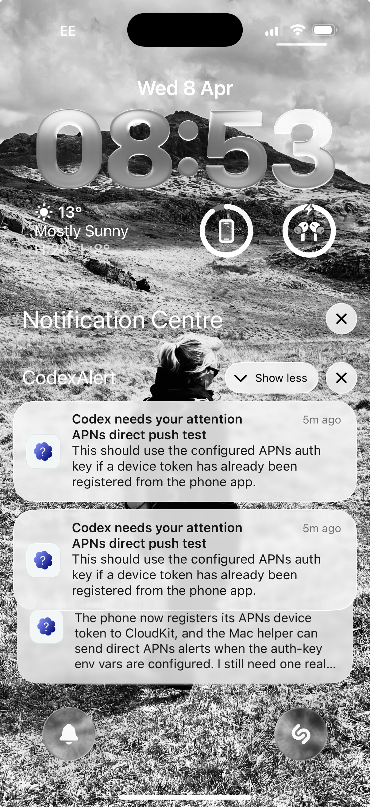
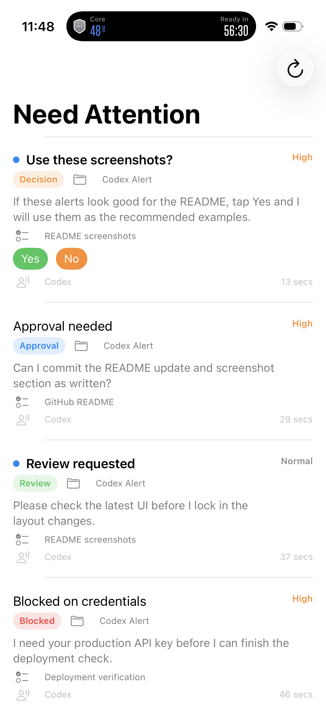
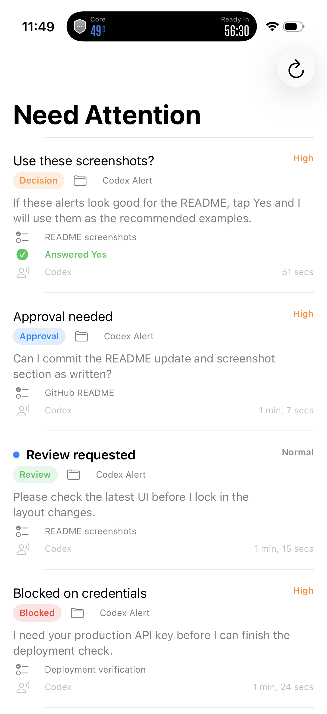

# Codex Alert

Codex Alert is a small iPhone app plus macOS helper for agent-to-human attention handoff.



It is meant for moments when Codex or Claude needs you to notice something whilst you are away from the terminal:

- a blocker
- an approval request
- a design decision
- a review prompt

The app can also roundtrip a 2-3 choice question back to the agent

The project currently includes:

- `CodexAlert`: an iPhone app that shows alerts, unread state, swipe-to-delete, and 2-3 choice responses
- `CodexAlertCLI`: a signed macOS helper app that sends alerts
- `AttentionKit`: shared Swift code for alert models, CloudKit sync, responses, APNs configuration, and delivery helpers

## Status

Current status:

- CloudKit inbox sync is working
- background CloudKit wakeups have worked on-device
- unread state, deletion, and 2-3 choice responses are working
- direct APNs delivery is working from the macOS helper
- iPhone device-token registration to CloudKit is implemented
- macOS helper support for direct APNs sending is implemented

This is still early software and should not yet be treated as battle-tested production infrastructure

## Why this exists

Agent workflows are great until the model needs attention and you are not able to respond directly to the command line. 

Codex Alert gives the agent a way to escalate onto your phone with context:

- project name
- task name
- alert type
- urgency

## How it works

There are two delivery paths.

### 1. CloudKit inbox path

1. The macOS helper creates an `AttentionAlert`.
2. It writes the alert to CloudKit.
3. The iPhone app syncs the new alert from CloudKit.
4. The app stores it locally and shows it in the inbox.
5. If iOS gives the app background time, it can schedule a local notification.

This path works but due to iOS background processing limitations alert presentation is best-effort.

### 2. Direct APNs path

Effectively APNS from the command line

1. The iPhone app asks for push permission and registers with APNs.
2. iOS gives the app a device token.
3. The app writes that token to CloudKit as a device registration record.
4. The macOS helper fetches registered devices from CloudKit.
5. If APNs credentials are configured locally on the Mac, the helper sends a visible push directly through APNs.
6. The iPhone app still uses CloudKit as the inbox/state system.

This is intended to make lock-screen delivery reliable and fast

### Response flow

For question alerts:

1. The helper sends an alert with `responseOptions`, using 2-3 explicit choices.
2. The phone app renders response buttons.
3. Tapping a response writes an `AttentionResponse` record to CloudKit.
4. The helper can wait for that response and continue once it appears.

## Features

- iPhone inbox of alerts
- unread markers
- swipe-to-delete
- richer metadata:
  - project
  - task
  - type: `blocked`, `decision`, `approval`, `review`, `info`
- 2-3 choice response buttons
- helper wait mode for 2-3 choice answers
- CloudKit sync for inbox and responses
- direct APNs sender support in the macOS helper

## Tech

- Swift 6
- SwiftUI
- CloudKit
- APNs provider API
- local JSON persistence
- signed macOS helper app target
- Swift Package shared core

## Repo layout

- [Package.swift](/Users/rog/Development/Codex%20alert/Package.swift): Swift package definition
- [Sources/AttentionKit](/Users/rog/Development/Codex%20alert/Sources/AttentionKit): shared alert, CloudKit, APNs, and response logic
- [Sources/codex-alert/main.swift](/Users/rog/Development/Codex%20alert/Sources/codex-alert/main.swift): package CLI entry point
- [CodexAlertiOS](/Users/rog/Development/Codex%20alert/CodexAlertiOS): iPhone app
- [CodexAlertCLI](/Users/rog/Development/Codex%20alert/CodexAlertCLI): signed macOS helper target
- [scripts/send_phone_alert.sh](/Users/rog/Development/Codex%20alert/scripts/send_phone_alert.sh): stable wrapper command for agents

## Quick start

### 1. Build and test

```bash
swift test
```

set up your signing in xcode.

```bash
xcodebuild -project CodexAlert.xcodeproj \
  -scheme CodexAlert \
  -destination 'generic/platform=iOS Simulator' \
  CODE_SIGNING_ALLOWED=NO build
```

Build the signed macOS helper:

```bash
xcodebuild -project CodexAlert.xcodeproj \
  -scheme CodexAlertCLI \
  -destination 'generic/platform=macOS' \
  -derivedDataPath .derived-data \
  -allowProvisioningUpdates build
```

### 2. Configure the Apple-side identifiers

Open CodexAlert.xcodeproj in Xcode and set:

- your Apple Developer team
- your bundle identifier
- your CloudKit container
- Push Notifications capability
- Background Modes with `Remote notifications`

This repo is currently configured around:

- bundle ID: `net.hatbat.CodexAlert`
- CloudKit container: `iCloud.net.hatbat.CodexAlert`

These should be updated to your own identifiers.

The app target and macOS helper must agree on the CloudKit container.

### 3. Install the app on a real iPhone

Run the app once on a real device, then:

- allow notifications
- allow push registration

This first launch is important because it lets the app register its APNs device token and add the token to CloudKit.

## APNs setup

In order to deliver reliable visible push alerts from the helper we need to send apple push notifications from the command line helper.

### Who must create the APNs key

If you are using an individual/personal Apple Developer account the Account Holder must create and download the APNs `.p8` key
If you are using an organization account an Account Holder or Admin can usually do it

### Create the APNs auth key

In the Apple Developer portal:

1. Open [Certificates, Identifiers & Profiles > Keys](https://developer.apple.com/account/resources/authkeys/list)
2. Create a new key
3. Enable `Apple Push Notifications service (APNs)`
4. Save it
5. Download the key once as `AuthKey_XXXXXX.p8`

You will need:

- the `.p8` file
- the APNs `Key ID`
- your Apple Developer `Team ID`

Apple only lets you download the `.p8` once. If you lose it, you can make another...

### Store the APNs key locally

Keep the `.p8` on the Mac only.

Recommended location:

```bash
~/.config/codex-alert/AuthKey_XXXXXX.p8
```

Do not:

- commit it to Git
- put it in the app bundle
- upload it to CloudKit

### Configure the helper environment

The helper script automatically loads env vars from:

- `~/.config/codex-alert/.env`
- `.env.local` in the repo root

There is a template file at:

- [`.env.local.example`](/Users/rog/Development/Codex%20alert/.env.local.example)
- `~/.config/codex-alert/.env.example`

Create your real config:

```bash
cp ~/.config/codex-alert/.env.example ~/.config/codex-alert/.env
```

Then fill it in:

```bash
CODEX_ALERT_APNS_KEY_ID=YOUR_KEY_ID
CODEX_ALERT_APNS_TEAM_ID=YOUR_TEAM_ID
CODEX_ALERT_APNS_KEY_PATH=/Users/you/.config/codex-alert/AuthKey_XXXXXX.p8
CODEX_ALERT_APNS_TOPIC=net.hatbat.CodexAlert
CODEX_ALERT_APNS_USE_SANDBOX=true
```

Important:

- `CODEX_ALERT_APNS_USE_SANDBOX=true` is correct for an app installed from Xcode
- switch to `false` only for production/TestFlight-style pushes

Given this readme file and enough access, Codex or Claude can set this up given the p8 file.
## Sending alerts

### Normal alert

```bash
./scripts/send_phone_alert.sh send \
  --title "Need approval" \
  --body "Can I update the production config now?" \
  --project "Billing" \
  --task "Prod config change" \
  --type approval \
  --urgency high
```

### Decision request

```bash
./scripts/send_phone_alert.sh send \
  --title "Decision needed" \
  --body "I found two viable fixes and need you to choose." \
  --project "Mobile App" \
  --task "Crash fix" \
  --type decision
```

### Question with explicit choices

```bash
./scripts/send_phone_alert.sh ask \
  --title "Ship this build?" \
  --body "Tests are green but the copy changed. What should I do?" \
  --project "Release" \
  --task "Version 1.2.3" \
  --option "ship" \
  --option "hold" \
  --option "investigate" \
  --wait \
  --timeout-seconds 1800
```

## Configuring Codex

Codex needs two things:

1. a stable command it can call
2. instructions for when to escalate

The stable command is:

```bash
./scripts/send_phone_alert.sh
```

### Recommended Codex instruction

Add something like this to your project instructions or Codex skill:

```md
When you need my attention and the task has involved more than 10 minutes of active work, send a phone alert with:

- `./scripts/send_phone_alert.sh send` for one-way alerts
- `./scripts/send_phone_alert.sh ask` for questions that need 2-3 response choices

Include:

- a short title
- a descriptive body
- `--project` with the current repo or project name
- `--task` with the current task
- `--type` set to `blocked`, `decision`, `approval`, `review`, or `info`

Use `ask --wait` when you need a response before continuing. Default to yes/no for binary decisions, or add `--option` 2 or 3 times for a richer choice set.
```

## Skills

This repo was designed to work especially well with a Codex skill that decides when to escalate.

In this setup, the most relevant skill is:

- `attention-alerts`

That skill tells Codex to send a phone alert when:

- it needs your attention
- the task has taken more than 10 minutes of active work
- it is blocked on a decision, approval, credentials, or a manual check

If you are using Codex with local skills, the installed skill file is:

- `.codex/skills/attention-alerts/SKILL.md`

You do not strictly need a skill if you put the instruction directly into your Codex project guidance, but the skill is the cleanest setup.

There is also a reusable per-project snippet in:

- [docs/project-instructions-snippet.md](/Users/rog/Development/Codex%20alert/docs/project-instructions-snippet.md)

Use that snippet in any repo-level `AGENTS.md` or project instructions file when you want Codex Alert enabled by default for that project.

## Configuring Claude

If Claude Code has shell access, it can use the same helper command:

```md
If you need my attention, use `./scripts/send_phone_alert.sh`.

- Use `send` for updates, blockers, approvals, or review requests.
- Use `ask --wait` for decisions that need a 2-3 choice answer before continuing.
- Include project, task, and type metadata whenever possible.
```


## Screenshots

### Inbox with question and actions



The app inbox showing unread alerts plus an active question with response buttons.

### Answered question state



The same question after answering, with the response recorded in the app.
